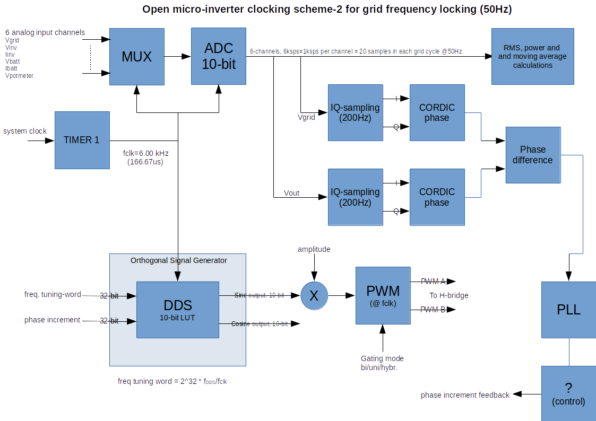
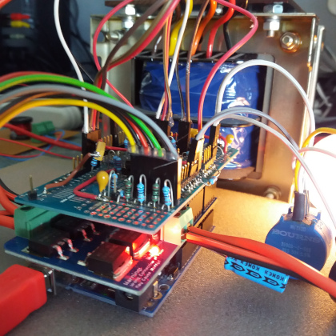

#  openMicroInverter 
### An open source hardware platform for experimenting with DC-to-AC conversion, power and energy metering and (possibly) grid tie inverters.

### What does the openMicroInverter?
The *openMicroInverter*, or in short *oμiv*, is an **Arduino-UNO based** DC-to-AC power converter. The *oμiv* platform is meant for doing experiments with power electronics and energy systems. The *oμiv* is intended to be configurable as:

1. DC-to-AC power inverter for off the grid applications,
2. AC-power and energy metering device,
3. inverter which phase-locks to the grid,
4. uninterruptible power supply,
5. solar-inverter or inverter for energy storage systems or as
6. bi-directional power converter.

Why then using the 8-bit Arduino-UNO? Just because it is fun to squeeze the most out of it:-) Furthermore, this project shows the full capabilities of the [TrueRMS](https://github.com/MartinStokroos/TrueRMS) Arduino library from one of my other repositories. Applications i, ii and iii have been successfully realized so far...

This is work in progress...

### How does it work?
The converter topology of the *oμiv* is a single-phase, single-step, transformer coupled power converter with a full-bridge inverter. This type of converter is not as efficient as the combination of a high frequency switching boost converter with DC-to-AC converter, but the *oμiv* is simple to build and it is relatively safe to operate.

### The Hardware
There are two versions of the hardware. The first design is the development model and second design is the final design of the *oμiv* platform. The development model has been used for the development of the software. Please refer to the schematic diagrams to understand further explanation.

**The openMicroInverter development hardware**
A rapid prototype of the inverter was realized for doing software development. The schematic of the development model is named *openMicroInverter_dev.pdf*.
A somewhat older H-bridge driver, the [HIP4082](/datasheets/hip4082.pdf), is used for the design. The HIP4082 is a medium voltage, medium frequency full-bridge driver, nowadays by *Renesas*. The driver has a build in turn-on delay to create dead time required for switching between the top and the bottom FET's. With this feature it is possible to drive the chip directly from the PWM generators of the ATmega328P (which are less sophisticated than the timers of STM32 micro-controllers...).

Currently I am investigating to use the [Dual Channel H-bridge Motor Shield from Elecrow](https://www.elecrow.com/dual-channel-hbridge-motor-shield-8a-22v-p-841.html) to enable experimenting with the inverter without to overcome too many hurdles for setting up the hardware. The high power DC-motor shield from Elecrow is a relatively new shield for *Arduino* including two 8A full H-bridges with discrete power MOSFETS.

**The openMicroInverter hardware**
The *oμiv* will be designed as a single PCB module and is build with low-cost components.

To be continued...

### Software Description
Arduino-UNO Pin-out:

Pin | In/Out | Function
--- | ------ | --------
A0 | input | scaled ac mains voltage biased on 2.5V DC
A1 | input | scaled ac inverter current biased on 2.5V DC
A2 | input | scaled ac inverter voltage biased on 2.5V DC
A3 | input | scaled battery current biased on 2.5V DC
A4 | input | scaled battery voltage input
A5 | input | optional analog input, currently used as potmeter control input
D2 | output | islanding relay (future function)
D3 | output | AHI control signal to HIP4082 H-bridge driver
D4 | output | debug output pin
D6 | input | external reference voltage input of the analog comparator (ZCD).
D8 | output | inverter enable output (a high=ON)
D9 | output | PWMB signal to HIP4082 H-bridge driver
D10 | output | PWMA signal to HIP4082 H-bridge driver
D7 | input | analog comparator input (AIN1) for zero-cross detection (ZCD) of the grid voltage. The analog comparator input is connected in parallel with A0.
D11 | output | BHI control signal to HIP4082 H-bridge driver
D13 | output | Arduino LED (future *PLL-locking* indicator)

**The use of Timers**
The standard Arduino library functions like *analogRead, analogWrite* and *digitalWrite* are very time consuming and can not be used with the *oμiv*. The software requirements are:

* The PWM frequency to steer the H-bridge must be chosen as high as possible.
* The ADC sampling frequency must be a multiple of 50Hz for stable RMS readings.
* If possible, the ADC should be synchronized to the timer used for the PWM generation to force the sampling to happen inbetween the switching transients.
* The PWM duty-cycle is limited by the hardware and can only be used up to about 90%. This is because of the charge pumps from the hi-side FET drivers of the HIP-4082 full-bridge driver. The dynamic range for control is limited in particular when using a 8-bit timer.
* TIM0 should not be used, to keep the *Arduino* time and delay functions functional. It is still possible to use the time functions in the program main loop.

Different schemes are are now being investigated to fit it all inside the Arduino and are::

Scheme | Description | Remarks
------ | ----------- | -------
*scheme-1* | TIM1 generates a PWM-frequency of 16MHz/512/4 = 7812.5Hz (128μs). The 50Hz reference waveform is generated by the DDS algorithm inside the TIM1 ISR. Each TIM1 interrupt the PWM is updated. The ADC-start is triggered by TIM1 and stays synced with TIM1. Six ADC-channels are time-multiplexed. A complete sequence of six channels takes 768us. The closesed whole number of samples that does fit in a 20ms mains cycle is 26.041. This causes a small ripple in the RMS readings. | With scheme, 1 the remaining available processing time in the TIM1 ISR is not enough for implementing power measurements.
*scheme-2* | TIM1 generates a PWM-frequency of 16MHz/(2*1333) = 6000Hz (166.67us). The TIM1 ISR function is empty and only needed to trigger the ADC. All DSP work is done inside the ADC ISR. The 50Hz reference waveform is generated by a DDS algorithm. Each ADC interrupt the PWM is updated and a single analog to digital conversion is processed. Six ADC-channels are time multiplexed. A complete sequence of six channels takes 1ms. Exactly 20 samples do fit in one mains cycle of 20ms. | So far the best scheme. Switching frequency is rather low and the duty-cycle ranges from about 12% to 88%. This is a little too limited and more than needed to keep the HIP-4082 hi-side chargepumps running...
*scheme-3* | TIM1 running at 6kHz triggers the ADC. The PWM is generated with TIM2 at the highest possible frequency. The PWM is not synchronized with the sampling proces and the wave amplitude resolution is only 8-bits. | To be confirmed...
*scheme-4* | ADC is free running and the PWM is generated by TIM1 or TIM2 for respectively 10- or 8-bit amplitude resolution in the output wave. The ADC frequency can not be a multiple of 50Hz and a ripple occurs in the RMS readings. | Scheme 4 doesn´t work. There is too much jitter in the sampling frequency when the ADC is in free running mode to be useful.

**Clocking scheme**
The implementation for the clocking scheme 2 as selected above, is shown in the following figure:

In this scheme, the zero crossing detector is no longer needed. The phase is detected by using quadrature sampling of the input signal and a CORDIC algorithm for calculating the phase angle relative to the ADC sampling clock. Both, the phase of the grid voltage and the phase of the DDS reference wave (switch to A), or the measured phase of the inverter output voltage (switch to B) are detected.
Example sketch *Inverter2.ino* is with the switch to position A sketch *Inverter3.ino* is with the switch to position B. 
The phase offset makes no sense in closed loop with the switch set to position B because the loop compensates for phase offsets. This  simplifies the signal generator. The clocking scheme simplifies to the diagram shown below.
The idea behind the structure of Inverter2 might be interesting for future applications. For now the development continues with Inverter3...

**H-bridge switching mode**
The following switching schemes have been implemented:

* unipolar switching
* bi-polar switching
* hybrid switching

**The *PowerSys* Library**
Refer to the readme file of the [PowerSys](/libraries/PowerSys/README.md) Library.

**The project's to do list**
1. evaluating the ACS712 series current sensors
2. optimizing the hybrid switching mode
3. increasing the effective duty-cycle range to 98% in hybrid-mode by using the AHI and BHI control signals to the HIP-4082 (or Elecrow motor shield)
4. implementing amplitude control in inverter mode
5. Now the inverter synchronizes to the grid but can not operate grid-connected since there is no output current control yet (It was tested only in a very controlled experimental setting)
6. Supply documentation and examples with the *PowerSys* library
7. Final *oμiv* hardware design and PCB lay-out.

### Example Sketches
- ZeroCrossingDetector.ino
  This example demonstrates Zero Crossing Detection (ZCD) with the analog comparator of the ATMEGA328. The comparator interrupts on output toggle. The sign of the sine wave is determined from the ADC input. The output of the ZCD only toggles from high to low when the sign of the AC input is positive and vice verse.

------

- Inverter1.ino
  Sketch to evaluate the different ways of gating the H-bridge to generate a sine wave output. This sketch works on the *openMicroInverter_dev* hardware. The inverter works in voltage-mode without output voltage control (open loop). The timing is according to *scheme-2*, which gives stable readings of the measurements but the switching frequency is on the low side and the duty-cycle range is limited between 12% and 88%. Unipolar switching runs the most smoothly.
 
------

- Inverter1b.ino
  This sketch is the same as for example *Inverter1.ino* but it was modified for use with Elecrow's Dual Channel H-bridge Motor Shield. The picture shows the sandwich from the bottom to the top of the Arduino UNO, the Elecrow H-bridge Motor Shield and the prototype shield for the analog readings. The lamp at the right side forms the small ballast of the inverter.

Connecting the transformer: Both legs of each H-bridge are in-phase, simultaneously switching. Tie M1_A and M1_B together and also tie M2_A and M2_B together. Connect the low voltage winding of the transformer between M1_A (M1_B) and M2_A (M2_B) or with double low voltage windings; connect the low voltage winding-1 between M1_A, M2_A and low voltage winding-2 between M1_B and M2_B. Check the phase of the windings first!

Conclusions:

- The voltage rating of the power MOSFET's from the Elecrow motor shield is 55V. This is rather low to have enough margin.
- There should be a large capacitor at the (motor) supply input of the motor shield. Cable inductance can cause high voltage spikes at the supply terminals which could damage the MOSFET's.
- I expected lower losses from the IRF3205S MOSFET's with an rds_on of 8mOhm. Probably the switching losses are quite high because of the high value gate resistors (51Ohm). The switching takes 200-300ns. The gate voltage might be increased to 15V.
- The motor shield works for demonstration purpose, but the board needs modifications to be useful with power converters.

------

- Inverter2.ino
  This sketch synchronizes the internal reference generator to the grid voltage. The DDS (inverter) output wave phase offset can be controlled with a potmeter connected with input A5 (see schematic  *openMicroInverter_dev.pdf* on how to connect the potentiometer)
  The plot below shows the grid phase and the inverter phase (arbitrary units) when locked. In the locked state the Arduino LED will turn on.
  If both lines run perfectly horizontal then the ADC sampling frequency is an exact multiple of 120 times the grid frequency. The grid frequency normally drifts around 50Hz and the *Arduino* crystal oscillator frequency drifts because of temperature effects and aging. The lines are usually not running horizontal, which is normal.

------

- Inverter3.ino
This sketch synchronizes the measured inverter output voltage to the grid voltage. The plot below shows the phase locking when the grid connection is turned on around time stamp 1140.

------

- Metering.ino
This sketch is a power meter and energy metering example that works for the *openMicroInverter_dev* hardware.
This sketch uses a time base on interrupt basis and uses an ADC multiplexer running at 6kHz (120*50Hz). Each ADC-channel samples at 1kHz. This example is without inverter drive (H-bridge + transformer and output filter). Re-wire the circuit such that A0 and A2 measure the AC-voltage and A1 the load current. The power is calculated from inputs A1 and A2.

### Acknowledgements
A lot of time was saved in development time by using the alternative Arduino-IDE *Sloeber*. Sloeber is a wonderful Arduino plugin for Eclipse.
