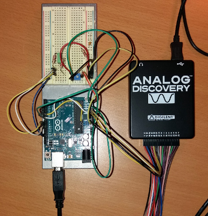

# openMicroInverter 
### An open source hardware platform for experimenting with DC-to-AC conversion, power and energy metering and grid tie inverters.

### What is the openMicroInverter?
The *openMicroInverter*, or short *oμI*, is an **Arduino-UNO based** DC-to-AC power converter. The *oμI* platform is meant for doing experiments with power electronics and energy systems. The *oμI* is intended to work as:

1. DC-to-AC power inverter for off the grid applications,
2. AC power meter and energy metering device,
3. an inverter which phase-locks to the grid,
4. solar-inverter or inverter for energy storage systems and
5. a bi-directional power converter.

Why then using the 8-bit Arduino-UNO? Just because it is fun to squeeze the most out of it:-) Furthermore, this project shows the full capabilities of the [TrueRMS](https://github.com/MartinStokroos/TrueRMS) Arduino library from one of my other repositories. Applications i, ii and iii have been successfully realized so far...

This work is in progress.

### How does it work?
The converter topology of the *oμI* is a single-phase, single-step, transformer coupled power converter with a full-bridge inverter. This type of converter is not as efficient as a high frequency switching boost converter with DC-to-AC converter, but the *oμI* is simple to build and relatively safe to operate.

### The Hardware
There are two versions of the hardware. The first is the development model and second the final design of the *oμI* platform. The development model has been used for the development of the software. Please refer to the schematic diagrams to understand further explanation.

**The openMicroInverter development hardware**
A rapid prototype of the inverter was realized for doing software development. The schematic of the development model is named *openMicroInverter_dev*.
A somewhat older H-bridge driver, the HIP4082, is used for the design. The HIP4082 is a medium voltage, medium frequency full-bridge driver, now distributed by *Renesas*. The driver has a build in turn-on delay to create dead time required when switching between the top and the bottom FET's. With this feature it is possible to drive the chip directly from the PWM generators of the ATmega328P, which are less sophisticated than the timers of for example STM32 controllers.

To be continued...

**The openMicroInverter hardware**
The *oμI* is designed as a single PCB and uses low-cost components. In contrast to the development model, it is designed with discrete components instead of using expensive transducer modules.
 
This work is under development...

### Software Description
Arduino-UNO Pin-out:

Pin | Function
--- | --------
A0 | scaled ac mains voltage biased on 2.5V DC. Full scale voltage is about 700Vpeak-to-peak.
A1 | scaled ac inverter current biased on 2.5V DC. Full scale current is about 5Apeak-to-peak.
A2 | scaled ac inverter voltage biased on 2.5V DC. Full scale voltage is about 700Vpeak-to-peak.
A3 | scaled battery current biased on 2.5V DC. Full scale current is .. A.
A4 | scaled battery voltage. Full scale voltage is .. V.
A5 | (optional)
D2 | grid connect relay
D4 | debug output pin
D6 | external reference voltage input for the comparator (ZCD).
D8 | inverter enable (a high=ON)
D7 | analog comparator input (AIN1) for zero-cross detection (ZCD) of the grid voltage. The analog comparator input is connected in parallel with A0.
D13 | Arduino LED as *PLL-locking* indicator

**Software timing scheme**
The standard Arduino library functions like *analogRead, analogWrite* and *digitalWrite* are very time consuming and can not be used with the *oμI*. The software requirements are:

* The PWM frequency to steer the H-bridge must be chosen as high as possible.
* The ADC sampling frequency must be a multiple of 50Hz for precise RMS readings.
* If possible, the ADC should be synchronized to the timer used for the PWM generation to force the sampling to happen inbetween the switching transients.
* The PWM duty-cycle is limited by the hardware and can only be used up to about 90%. This is because of the charge pumps from the hi-side FET drivers of the HIP-4082 full-bridge driver. The dynamic range for control is limited in particular when using a 8-bit timer.
* TIM0 should not be used to maintain the working of the Arduino time and delay functions used in the program main loop.

*Scheme 1*
TIM1 generates a PWM-frequency of 16MHz/512/4 = 7812.5Hz (128μs). The 50Hz reference waveform is generated by a DDS algorithm in the TIM1 ISR. Each TIM1 interrupt the PWM is updated. The ADC-start is triggered by TIM1 and runs in sync with the timer. 6 ADC-channels are multiplexed in time. A complete sequence of 6 channels takes 768us. The closesed number of samples that does fit the mains cycle of 20ms is 26.041. This will cause a small ripple in the RMS-readings.

*Scheme 2*
TIM1 generates a PWM-frequency of 16MHz/(2*1333) = 6000Hz (166.67us). The TIM1 ISR function is empty and only needed for triggering of the ADC. All the DSP work is done in the ADC ISR.
The 50Hz reference waveform is generated with a DDS algorithm. Each ADC interrupt the PWM is updated and a single analog to digital conversion is processed. 6 ADC-channels are time multiplexed. A complete sequence of 6 channels will take 1ms. Exactly 20 samples do fit in one mains cycle of 20ms.

*Scheme 3*
ADC is free running, PWM generated by TIM1 or TIM2, for respectively 10- or 8-bit amplitude resolution in the output wave. The ADC frequency can not be a multiple of 50Hz and a ripple occurs in the RMS readings. To be confirmed...

*Scheme 3*
ADC is free running, PWM generated by TIM1 or TIM2, for respectively 10- or 8-bit amplitude resolution for the output wave. The ADC frequency can not be a multiple of 50Hz and a ripple occurs in the RMS readings. To be confirmed...

### The *PowerSys* library
This library contains modules used for power converter control. One of the basic functions is generating the reference waveform. It is based on Direct Digital Synthesis and has special features for synchronizing the reference waveform with the grid frequency.

Details will follow...

### Example Sketches
*Metering.ino* - This sketch is a power meter and energy metering example tested on the openMicroInverter_dev hardware.
This sketch uses a time base on interrupt basis and uses an ADC multiplexer running at 6kHz (120*50Hz). This example works without inverter (H-bridge + transformer and output filter). Re-wire the circuit such that A0 and A2 measure the AC-voltage and A1 the load current. The power is calculated from inputs A1 and A2.

#

Testing the software with input signals generated with the Digilent *Analog Discovery*.
The two-channel function generator of the *Analog Discovery* is very handy when simulating phase shifting between voltage and current input signals.

