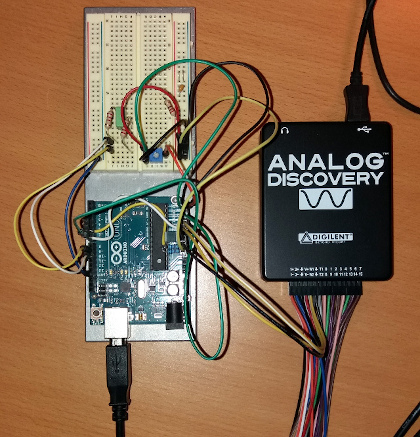

# PowerSys Library
This library contains modules used to control power convertersl. One of the basic functions of the library is generating the reference waveform. The generator is based on Direct Digital Synthesis and has special features to keep it in sync with the grid voltage.

#

Testing the software with input signals generated with the Digilent *Analog Discovery*. The two-channel function generator of the *Analog Discovery* is very handy when simulating phase shifts between voltage and current input signals.

